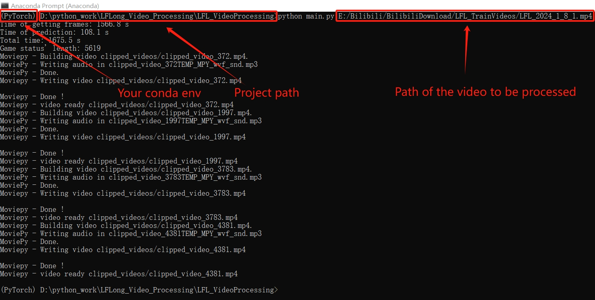
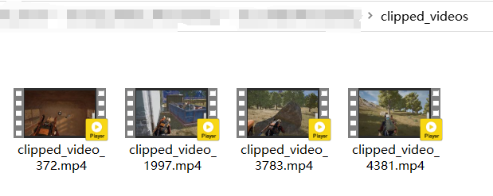
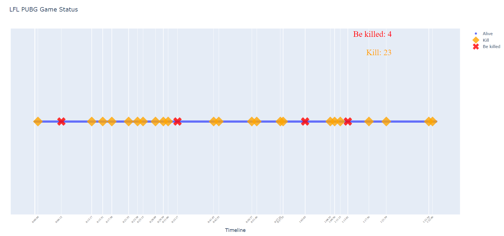

# PUBG_Live_Video_Auto-Clipping
## Description
This is a simple project of automatically  clipping my favorite PUBG live stream moments. The **input** is a mp4 file of PUBG live video, and the **outputs** are the funny 1 minute being killed moments in folder clipped_videos and the player status visualization in folder Plot_Data.

## Necessary python environment
python 3.8.18
- PIL
- moviepy
- torch
- torchvision
- time
- datetime
- numpy
- pandas
- sys
- plotly

## Usage 
1. Clone this repository to your local directory. For example, `D:\Github_clonespace\PUBG_Live_Video_Auto-Clipping`. 

2. Prepare a PUBG live video of mp4 file. For example, `D:\Download_Videos\PUBG_video.mp4`.

3. Anaconda Prompt
```{bash}
activate your_envs_name
cd D:\Github_clonespace\PUBG_Live_Video_Auto-Clipping
python main.py D:/Download_Videos/PUBG_video.mp4
```

Please kindly note that the last line use slash "/" instead of backslash "\\".



## Outputs
### one-minute being killed moments in folder **clipped_videos**



Yes, I am the bad guy who enjoy watching streamers being killed. 

### player status visualization in folder **Plot_Data**


## Shortcoming
Processing a 60-minute video takes about 10 minutes. Because reading frames from a video through moviepy library costs too much time. Hope making an improvement in the future if time permits.
